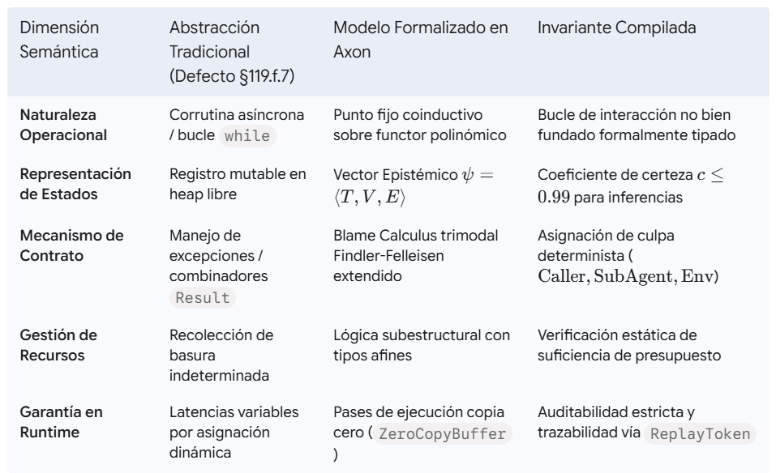
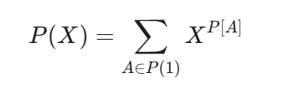
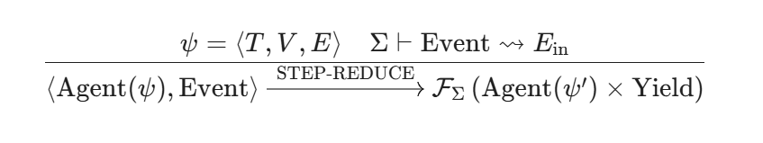
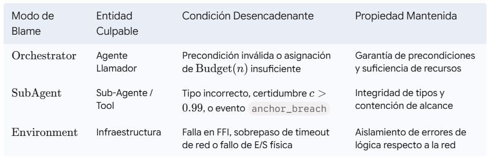
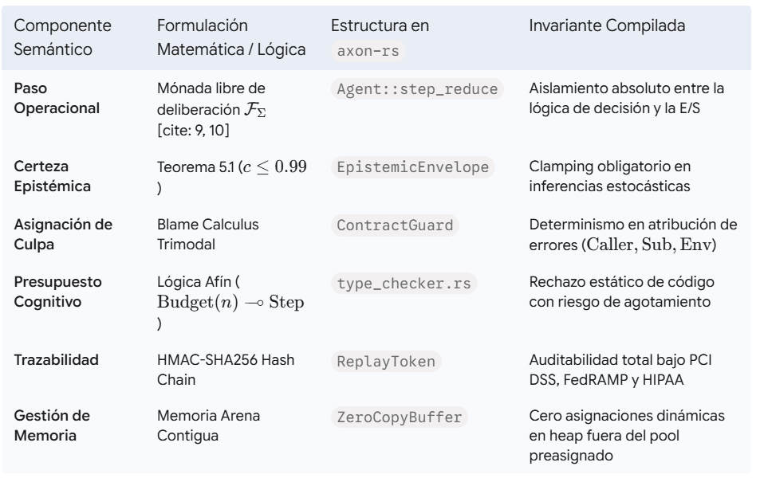

Formalización Semántica del Sintagma Agent en Axon: Un Paradigma Coinductivo, Subestructural y Teórico de Contratos para la Prevención de la Degradación del Compilador

Introducción y Planteamiento del Defecto

La evolución de los lenguajes de programación orientados a la orquestación de sistemas autónomos exige superar las abstracciones informales que reducen el concepto de agente a meros hilos de ejecución o bucles de control asíncronos. Cuando una arquitectura de lenguaje acepta la incorporación de la palabra clave agent dentro de su Árbol de Sintaxis Abstracta (AST) de forma prematura, se incurre de forma irreversible en el defecto formal catalogado como §119.f.7: la introducción de azúcar sintáctico sobre abstracciones no probadas. Este defecto degrada el compilador al ocultar bajo una fachada léxica operaciones que carecen de semántica denotacional y operacional congeladas, imposibilitando el razonamiento estático sobre la convergencia, la contención de efectos y la gestión del espacio de estados epistémico.

En el lenguaje de programación Axon, la prevención de la degradación del compilador se estructura mediante una estrategia de investigación adversarial y paper-first. Esta metodología exige que cualquier construcción sintáctica sea contrastada de manera formal contra la base de código del motor de ejecución nativo (axon-rs) antes de que el parser en axon-frontend reciba la capacidad de reconocer el sintagma. Para formalizar el comportamiento de agent y garantizar un mecanismo de trinquete (ratchet) insoslayable contra retrocesos de diseño, la especificación se asienta sobre cuatro ejes semánticos no negociables: el modelado coinductivo del espacio de estados, el cálculo de culpa trimodal para delegaciones de orden superior, la lógica subestructural afín para recursos cognitivos y el protocolo de validación por puertas de deriva (drift gates).

Eje 1: Espacio de Estados Epistémicos y Cálculo de Reducción Operacional

Semántica Coinductiva sobre Functores Polinómicos

Frente a la visión reduccionista de considerar a un agente como una corrutina o un bucle while(true), la semántica de Axon define a un agente como un punto fijo coinductivo sobre un functor polinómico de eventos en la categoría $\text{Set}$. Los functores polinómicos permiten desacoplar la interfaz de entrada/salida y las decisiones internas de la estructura de interacción continua.

Dado un functor polinómico $P: \text{Set} \to \text{Set}$, expresado operacionalmente como:

$$P(X) = \sum_{A \in P(1)} X^{P[A]}$$

donde $P(1)$ denota el conjunto de posiciones (estados de decisión alcanzables) y $P[A]$ el conjunto de direcciones (respuestas o eventos procedentes del entorno), la computación del agente no busca evaluar un valor final mediante inducción finita. Por el contrario, se formaliza mediante el álgebra libre $\mathfrak{m}_P$ y la comónada colibre $\mathfrak{c}_P$, donde $\mathfrak{m}_P$ codifica árboles de decisión finitos y $\mathfrak{c}_P$ representa el espacio de comportamiento infinitario no bien fundado del agente expuesto al entorno.

Un paso de ejecución de un agente no es una operación arbitraria de entrada y salida; es la reducción de una mónada libre de deliberación $\mathcal{F}_{\Sigma}$, la cual suspende la ejecución y produce una continuación expresada en términos de un árbol de sintaxis abstracta interpretable por el runtime.

El Vector de Estado Epistémico

La configuración instantánea de un agente en el sistema de tipos de Axon se formaliza mediante el sobre de estado epistémico $\psi$:

$$\psi = \langle T, V, E \rangle$$

En esta tupla, $T$ representa la especificación del objetivo o tarea activa (Task Specification), $V$ constituye el mapa de variables y contextos funcionales, y $E$ corresponde al vector de métricas epistémicas de la información retenida:

$$E = \langle c, \tau, \rho, \delta \rangle$$

- $c \in [0.0, 1.0]$: Coeficiente escalar de certeza del conocimiento acumulado.
- $\tau \in \mathbb{N}$: Marca de tiempo lógica o época epistémica asociada a la última actualización.
- $\rho \in \mathbb{R}^+$: Métrica de entropía y dispersión del estado.
- $\delta$: Grafo acíclico dirigido (DAG) de linaje del conocimiento (provenance tree).

Regla de Transición de Paso ($\text{STEP-REDUCE}$)

La reducción operacional de un agente se rige por la regla de inferencia formal $\text{STEP-REDUCE}$. Ante la llegada de un evento estructurado $\text{Event} \in \Sigma$, la reducción consume la mónada libre de deliberación y retorna el agente transformado junto con una señal de rendimiento intermedio (Yield):

donde la transformación del sobre epistémico $\psi \mapsto \psi'$ ocurre mediante una función de actualización condicional $f_{\text{epistemic}}(\psi, \text{Event})$ que preserva la consistencia lógica del estado del agente.

nvariante Epistémica (Teorema 5.1)

Teorema 5.1 (Invariante Epistémica de Certeza Flotante): Cualquier paso operacional $\text{STEP-REDUCE}$ que derive conocimiento mediante procesos estocásticos, o que delegue deliberación en un Modelo de Lenguaje de Gran Escala (LLM) o sub-agente, debe clampelar el coeficiente de certeza del nuevo sobre de estado $E'$ a un valor límite superior de $c \le 0.99$. Únicamente las afirmaciones procedentes de hechos inmutables respaldados por axonstore/corpus o datos crudos de sensores físicos verified-by-hardware retienen un valor absoluto de $c = 1.0$.

Demostración (Boceto Formativo):
Sea $f_{\text{llm}}: \mathcal{S} \to \mathcal{S}$ una función de transición de estado no determinista definida sobre un espacio de probabilidad tokenizado. Sea $H(f_{\text{llm}}) > 0$ la entropía de información del canal de inferencia. Supóngase por contradicción que la reducción de un paso impulsado por $f_{\text{llm}}$ produce un estado $E'$ con $c(E') = 1.0$. Por definición de certidumbre absoluta en la teoría de la información de Shannon, un valor de $c = 1.0$ exige que la entropía condicional del estado dado la evidencia sea $H(E' \mid \text{Event}) = 0$. Sin embargo, dado que $H(f_{\text{llm}}) > 0$, la composición del estado con la función de inferencia estocástica satisface:

$$H(E' \mid \text{Event}) \ge H(f_{\text{llm}}) > 0$$

Esto genera una contradicción con la condición de entropía nula requerida para la certidumbre absoluta. Por tanto, el valor de certidumbre resultante de cualquier derivación estocástica o de sub-agente debe estar acotado por $1 - \varepsilon$, donde $\varepsilon \ge 0.01$ representa el límite de entropía del canal de inferencia, garantizando $c(E') \le 0.99$. En contraposición, los hechos leídos desde axonstore proceden de transformaciones deterministas donde $H(\text{Fact}) = 0$, permitiendo sostener $c = 1.0$. 

Eje 2: Semántica de Delegación y Blame Calculus Trimodal

Contratos de Orden Superior y Filas de Efectos

La interacción entre agentes o la invocación de herramientas externas en Axon no se procesa mediante llamadas a procedimientos convencionales. En su lugar, activa contratos de orden superior construidos sobre una fila de efectos (effect row) tipada:

$$\text{EffectRow} = \langle \text{io}, \text{network}, \text{epistemic}: E \rangle$$

La presencia de la fila de efectos garantiza que cualquier transición de estado que involucre comunicación entre fronteras de aislamiento esté supervisada por un envoltorio de monitoreo (contract guard). Extendiendo el cálculo clásico de asignación de culpa (Blame Calculus) de Findler-Felleisen, Axon implementa un esquema de responsabilidad trimodal:

$$\text{Blame} \in \{\text{Orchestrator}, \text{SubAgent}, \text{Environment}\}$$

Orchestrator (Caller)  ──(Invocación de Sub-Agente)──>  Contract Guard (Findler-Felleisen)
                                                                │
                        ┌───────────────────────────────────────┼───────────────────────────────────────┐
                        ▼                                       ▼                                       ▼
             [Fallo de Precondición /                 [Violación de Postcondición /          [Fallo de Infraestructura /
                  Presupuesto Insuficiente]                 Ancla de Contención]                     Timeout de Red]
                        │                                       │                                       │
                        ▼                                       ▼                                       ▼
               Blame::Orchestrator                       Blame::SubAgent                        Blame::Environment

Clasificación y Asignación Formal de Culpa

Culpa Positiva ($\text{Blame::Orchestrator}$)

Asignada al agente orquestador o llamador cuando este viola las precondiciones estipuladas antes de invocar la rutina delegada. Las violaciones típicas comprenden el paso de argumentos fuera de los dominios válidos o la provisión de un presupuesto cognitivo afín insuficiente $\text{Budget}(n)$ para ejecutar la tarea requerida.

Culpa Negativa ($\text{Blame::SubAgent}$)

Asignada al agente subordinado o herramienta invocada cuando el resultado retornado incumple las poscondiciones del contrato. Esto abarca el retorno de tipos no conformes, la violación del Teorema 5.1 al reportar $c > 0.99$ sobre conocimiento derivado, o la activación de un fallo por anchor_breach, el cual ocurre cuando el sub-agente intenta modificar recursos fuera de su ámbito de contención concedido.

Culpa Ambiental ($\text{Blame::Environment}$)

Asignada al entorno de ejecución subyacente cuando la falla no es atribuible a la lógica interna de ninguno de los componentes de software. Esto incluye erogaciones por sobrepaso de tiempo límite (timeouts), rupturas de fronteras FFI nativas, corruptela de memoria o caídas en los canales de transporte de red.

Esta partición trimodal permite que las propiedades de proyección del contrato permanezcan invariantes bajo transformaciones del código, asegurando que los fallos reportados en tiempo de ejecución identifiquen de manera inequívoca al componente responsable

Eje 3: Lógica Subestructural del Presupuesto Cognitivo

Tipos Afines para el Control de Recursos Irrecuperables

Los pasos de reducción de un agente consumen recursos que no se pueden recuperar ni duplicar: tokens de cómputo en modelos de lenguaje, tiempo en GPU y cuotas de peticiones de red. En consecuencia, el sistema de tipos intuicionista estándar —donde las variables pueden duplicarse mediante contratación o ignorarse mediante debilitamiento— es inadecuado para modelar el contexto de un agente.

Axon emplea una lógica subestructural afín para gobernar el presupuesto cognitivo. Bajo un sistema de tipos afines, cualquier recurso asignado debe ser consumido a lo sumo una vez. La firma de reducción de paso se formaliza mediante la implicación afín ($\multimap$):

$$\text{Budget}(n) \multimap \text{Step} \to (\text{StepOutput} \times \text{Budget}(n - k))$$

donde $n$ representa la cuota total de recursos cognitivos disponibles y $k$ equivale al costo previsto o consumido por la ejecución del paso actual.

 ┌────────────────────────┐
       │   Budget(n) (Afín)     │
       └───────────┬────────────┘
                   │
                   │  Consumo de k unidades (n - k)
                   ▼
       ┌────────────────────────┐
       │ Compilador Axon (AST)  │
       └───────────┬────────────┘
                   │
         ┌─────────┴─────────┐
         │ ¿ (n - k) < 0 ?   │
         └────┬─────────┬────┘
           Sí │         │ No
              ▼         ▼
  ┌──────────────┐   ┌────────────────────────────────────────┐
  │ Error de     │   │ Permite Compilación                    │
  │ Compilación  │   │ Retorna StepOutput × Budget(n - k)     │
  └──────────────┘   └────────────────────────────────────────┘

  Verificación Estática y Manejadores de Compactación

  Durante la fase de análisis semántico, el verificador de tipos de Axon calcula el límite superior del consumo de recursos para cada rama del árbol de ejecución. Si la reducción estática predice que el presupuesto restante satisface:

  $$n - k < 0$$

  el compilador aborta inmediatamente la fase de construcción emitiendo un error de agotamiento de presupuesto cognitivo. La compilación únicamente se autoriza si el código fuente incluye un manejador explícito de degradación o compactación de contexto mediante los combinadores refine o weave.

- refine: Combinador que filtra el contexto histórico descartando metadatos epistémicos secundarios para reducir el costo $k$ en reducciones subsecuentes.
- weave: Operador de compactación que toma múltiples ramas de deliberación paralelas y las sintetiza en un único sobre epistémico denso, restaurando el margen de presupuesto mediante compresión semántica.

Eje 4: Protocolo de Reintegración con la Base de Código (axon-rs)

La validación empírica de la semántica teórica del sintagma agent se logra mediante su enfrentamiento directo con el motor de ejecución nativo en Rust (axon-rs). Este proceso se organiza en torno a tres puertas de deriva (drift gates), las cuales operan como trinquetes (ratchets) para evitar la admisión de código que no cumpla las especificaciones semánticas.

Puerta de Deriva 1: Fase Frontend (axon-frontend)

El parser en axon-frontend no reconocerá la palabra clave agent como una palabra reservada válida hasta que el analizador en type_checker.rs valide dos invariantes fundamentales:

1. Tipado Continuo del Sobre Epistémico: Confirmación de que el estado $\psi$ cumple con los límites de la lógica afín $\text{Budget}(n)$.

2. Transformación a Continuaciones Delimitadas: Verificación de que las expresiones del cuerpo del agente sean completamente traducibles a formas de paso de continuaciones (CPS) mediante los operadores $\text{shift}$ y $\text{reset}$. Esta transformación permite pausar, serializar y reanudar la ejecución del agente sin alterar la pila de llamadas nativa.

// axon-frontend/src/type_checker.rs

pub fn validate_agent_node(
    ctx: &mut TypeContext,
    agent_node: &AgentASTNode
) -> Result<TypedAgentExpr, TypeError> {
    // 1. Validar el presupuesto afín estático
    let static_budget = ctx.infer_budget(&agent_node.body)?;
    if static_budget.is_potentially_negative() && !agent_node.has_degradation_handler() {
        return Err(TypeError::UncheckedCognitiveExhaustion {
            loc: agent_node.location,
        });
    }

    // 2. Comprobar la transformación CPS delimitada (shift/reset)
    let delimited_cps = transform_shift_reset(&agent_node.body)?;
    if !delimited_cps.is_sound() {
        return Err(TypeError::InvalidContinuationBoundary {
            loc: agent_node.location,
        });
    }

    Ok(TypedAgentExpr::new(agent_node, static_budget, delimited_cps))
}

> **Estado de implementación (axon-lang 4.1.0).** De los dos invariantes de esta puerta, el primero está implementado en `type_checker.rs` como reglas cerradas: `axon-T1216` exige un `max_iterations` positivo (el mismo predicado que `axon-T877` aplica a `savant`), `axon-T1217` exige que `strategy: custom` lleve su secuencia de pasos y que ninguna otra estrategia la lleve, `axon-T1218` exige que toda llamada `<Agente>(…)` resuelva a un agente declarado, `axon-T1219` tipa `return:` y lo contrasta con el `output:` del paso que llama, y `axon-T1220` exige que `max_time:` sea una duración legible. El presupuesto afín $	ext{Budget}(n)$ se consume en el runtime antes de cada deliberación (iteraciones, tokens, costo y reloj de pared). El segundo invariante — la transformación a continuaciones delimitadas (shift/reset) — es diseño, no implementación: el bucle se ejecuta como un walker sobre `pure_shape` y no serializa su pila; `on_stuck: hibernate` se rehúsa por nombre precisamente porque esa continuación no existe todavía.

Puerta de Deriva 2: Fase Runtime (flow_dispatcher)

En la capa de ejecución nativa, el módulo flow_dispatcher procesa cada transición de paso asegurando reproducibilidad absoluta. Cada reducción emite un ReplayToken canónico encadenado dinámicamente.

El ReplayToken es un identificador criptográfico definido mediante la relación:

$$\text{ReplayToken}_i = \text{HMAC-SHA256}\left(K, \text{ReplayToken}_{i-1} \parallel \text{Hash}(\psi_i) \parallel \text{Hash}(\text{Event}_i)\right)$$

Este encadenamiento hash asegura que la secuencia completa de deliberaciones sea $100\%$ auditable y reproducible, garantizando la conformidad de los agentes ejecutados en Axon con regulaciones internacionales de audibilidad como PCI DSS (sección 10.2), FedRAMP High y HIPAA (§ 164.312).

// axon-rs/src/flow_dispatcher.rs

pub struct ReplayToken {
    pub step_index: u64,
    pub previous_hash: [u8; 32],
    pub current_state_hash: [u8; 32],
    pub signature: [u8; 64],
}

impl FlowDispatcher {
    pub fn dispatch_step(
        &mut self,
        agent: &mut AgentInstance,
        event: Event
    ) -> Result<YieldOutput, DispatchError> {
        let prev_token = self.audit_log.last_token();
        
        // Ejecución del paso operacional
        let (next_state, yield_out) = agent.step_reduce(event)?;
        
        // Enforzar Invariante Epistémica (Teorema 5.1)
        if next_state.epistemic.certainty > 0.99 && !next_state.is_ground_truth() {
            return Err(DispatchError::EpistemicInvariantViolation);
        }

        // Generar ReplayToken encadenado
        let current_token = ReplayToken::mint(&prev_token, &next_state, &yield_out);
        self.audit_log.append(current_token)?;

        Ok(yield_out)
    }
}

Puerta de Deriva 3: Fase de Integración E2E y Copia Cero

La tercera puerta de deriva verifica la gestión de memoria en el nivel de integración de hardware. La ejecución de un paso de agente tiene prohibido realizar asignaciones dinámicas en el heap global (alloc::heap::allocate) fuera del contenedor de memoria de copia cero denominado ZeroCopyBuffer.

Toda la transformación de estados y el almacenamiento temporal de continuaciones deben realizarse en regiones contiguas preasignadas en memoria arena. La suite de pruebas de integración continua (CI/CD) de axon-rs evalúa el perfil de ejecución nativo; la detección de una sola asignación fuera del ZeroCopyBuffer invalida automáticamente el build del compilador, previniendo regresiones de latencia indeterminadas.

Síntesis Teórica y Matriz de Control de Trinquetes

La formalización del sintagma agent en el lenguaje Axon sustituye las heurísticas de ejecución no verificables por un marco denotacional y operacional mathematically sound. Al fundamentar la abstracción sobre la teoría de functores polinómicos, el cálculo de culpa de orden superior, los tipos afines y las puertas de deriva en el motor ejecutor, Axon erradica la posibilidad de cometer el defecto §119.f.7.

Esta especificación congelada actúa como la salvaguarda definitiva de Axon: ningún cambio de código dentro del frontend o del runtime será aceptado a menos que satisfaga plenamente las cuatro dimensiones formales expresadas en este documento fundacional.

Autor: Ricardo Velit