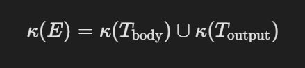
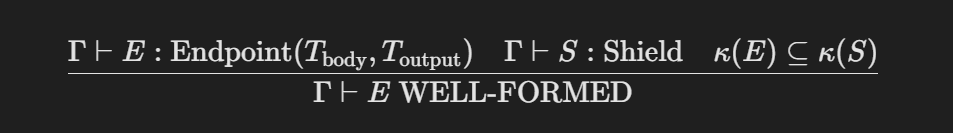
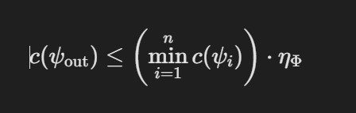
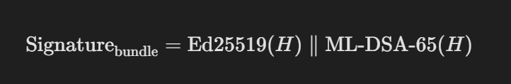
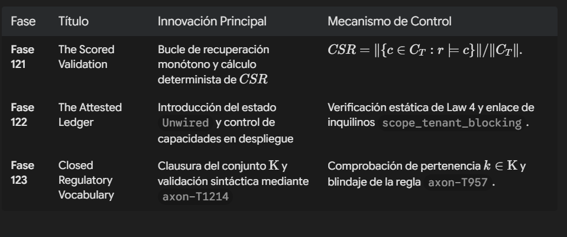
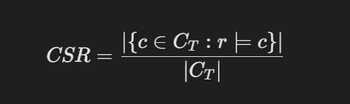
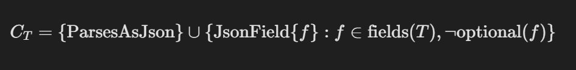

Fundamentos Criptográficos y de Teoría de Tipos para la Verificación de Conformidad en Tiempo de Compilación: El Paradigma de Auditoría Determinista de AXON

1. Introducción y Formulación del Problema

La integración de la inteligencia artificial generativa y los modelos de lenguaje (LLMs) en sistemas de software críticos para la empresa ha expuesto una deficiencia estructural en la ingeniería de sistemas: la traslación de las garantías de conformidad regulatoria a comprobaciones heurísticas en tiempo de ejecución o a declaraciones puramente documentales. En las arquitecturas convencionales, las afirmaciones de cumplimiento normativo respecto a marcos como HIPAA, GDPR, PCI DSS o SOC 2 se gestionan mediante anotaciones en prosa o metadatos no verificados por el compilador. Cuando un entorno de desarrollo o un motor de compilación procesa una asignación sintáctica arbitraria como compliance: [NOT_A_FRAMEWORK] sin generar una denegación formal en la etapa de análisis semántico, la promesa de "conformidad en tiempo de compilación" (compile-time compliance) se degrada a una aseveración infundada con graves implicaciones jurídicas, operativas e institucionales.

2. Teoría de Tipos Regulatorios y Cálculo $\lambda_{\mathrm{L}-\mathrm{E}}$

La arquitectura de AXON formaliza la seguridad y la conformidad mediante el Cálculo Lambda Lineal Epistémico ($\lambda_{\mathrm{L}-\mathrm{E}}$), en el cual cada término del lenguaje transporta un vector de estado epistémico y una firma de clase regulatoria como un tipo de dato de primer orden.

2.1 El Vocabulario Regulatorio Cerrado $\mathrm{K}$

Se define el universo cerrado de clases regulatorias admisibles $\mathrm{K}$ mediante el conjunto finito de alfabetos normativos validados por el compilador axon-frontend:

$$\mathrm{K} = \{ \text{HIPAA}, \text{PCI\_DSS}, \text{GDPR}, \text{SOX}, \text{FINRA}, \text{ISO27001}, \text{SOC2}, \text{FISMA}, \text{GxP}, \text{CCPA}, \text{NIST\_800\_53}, \text{NOM151}, \text{LFPDPPP}, \text{LGPD}, \text{LEY1581} \}$$

Este conjunto es exactamente el que la constante `REGULATORY_CLASSES` declara en `axon-frontend/src/compliance.rs`, y la correspondencia no se sostiene por revisión editorial: una prueba de la suite extrae $\mathrm{K}$ de este documento y falla la compilación si difiere del catálogo del compilador en miembros u orden. Cualquier identificador ajeno a $\mathrm{K}$ produce una denegación verificable ejecutando `axon check`.

Las cuatro últimas clases incorporan las jurisdicciones latinoamericanas atendidas por el producto (Fase 124). Su criterio de admisión es la prioridad de producto respaldada por un mecanismo existente en el lenguaje — sellado en `axonstore` para NOM-151, redacción en `shield` para las tres normas de privacidad — y no una propiedad formal que las distinga de otras normativas regionales: la Ley 25.326 de Argentina o la Ley 81 de Panamá impondrían exactamente la misma restricción de cobertura si se incorporasen. Se documentan como cobertura de ejecución en la matriz de §3 mientras no ingresen a $\mathrm{K}$.

**Distinción entre dos catálogos.** $\mathrm{K}$ no debe confundirse con el conjunto de marcos de auditoría contra los que el sistema se evalúa. Son catálogos separados por diseño y responden a preguntas distintas: $\mathrm{K}$ clasifica *qué es un dato* (una etiqueta de sensibilidad que viaja con el tipo), mientras que los marcos de auditoría — $\{\text{SOC 2 Type II}, \text{ISO/IEC 27001}, \text{FIPS 140-3}, \text{CC EAL4+}\}$, enumerados como `FrameworkId` en el motor de evidencias — definen *contra qué norma se mide la implementación*. Un dato no se etiqueta como «FIPS 140-3»; un módulo criptográfico se audita contra él.

En la Fase 123 del lenguaje, el analizador semántico incorpora el verificador axon-T1214, el cual efectúa un recorrido obligatorio sobre las cuatro únicas declaraciones sintácticas capaces de portar la propiedad compliance: (type, shield, axonendpoint y manifest). Si una declaración contiene un identificador $k \notin \mathrm{K}$, el proceso de compilación se interrumpe de forma inmediata. La comparación es sensible a mayúsculas y minúsculas: `hipaa` no es `HIPAA`, dado que ambas cadenas se agrupan de forma distinta en el expediente de evidencias, en el SBOM y en el empaquetador de auditoría.

Con el fin de ofrecer diagnósticos precisos sin relajar la exigencia formal, el sistema calcula una distancia de edición de Levenshtein acotada a la unidad $d_{L}(s, k) \leq 1$ sobre $\mathrm{K}$ — inserción, supresión o sustitución de un único carácter — emitiendo una sugerencia únicamente cuando la coincidencia es unívoca (por ejemplo, sugiriendo HIPAA ante la presencia de HIPPA, o PCI_DSS ante PCI-DSS). Ante una coincidencia ambigua el sistema no sugiere nada: proponer el marco regulatorio equivocado es un error de mayor gravedad que el silencio.

2.2 Álgebra de Cobertura de Escudos y Reglas de Inferencia

Sea $T$ un tipo de dato en AXON codificado con una etiqueta de sensibilidad regulatoria $\kappa(T) \subseteq \mathrm{K}$. Sea $E$ un punto de entrada o frontera de red (axonendpoint) con un tipo de entrada $T_{\text{body}}$ y un tipo de salida $T_{\text{output}}$. La clase regulatoria acumulada en la frontera se formaliza como la unión de las etiquetas de sus tipos constituyentes:

$$\kappa(E) = \kappa(T_{\text{body}}) \cup \kappa(T_{\text{output}})$$

Para que la frontera $E$ sea tipada correctamente bajo la doctrina axon://logic/every_boundary_is_guarded, debe asociarse a un escudo de protección (shield) $S$ asignado explícitamente. El compilador evalúa la Regla de Inclusión de Coberturas (Regla ESK 6.1):

Si la diferencia de conjuntos $\kappa(E) \setminus \kappa(S) \neq \emptyset$, el compilador genera un rechazo de tipo axon-T957, identificando las clases regulatorias desprotegidas. La clausura de $\mathrm{K}$ introducida en la Fase 123 garantiza la solidez de esta regla: en versiones anteriores, si un tipo declaraba una errata como [HIPPA] y el escudo declaraba la misma errata [HIPPA], la diferencia de conjuntos evaluaba a un conjunto vacío $\emptyset$, permitiendo que una frontera regulada se compilara sin una protección real. Al invalidar la errata en la etapa léxico-semántica antes de evaluar el subconjunto, el sistema elimina por completo la posibilidad de satisfacer leyes de cobertura mediante coincidencias simétricas de términos no reconocidos.

La secuencia de verificación estática procesa secuencialmente la declaración de tipos y la estructura del punto de entrada. Primero, el analizador verifica que todas las etiquetas pertenecientes a $\kappa(T)$ se encuentren en $\mathrm{K}$ mediante la regla axon-T1214. A continuación, la frontera de red se inspecciona para constatar la presencia de la propiedad shield:; la ausencia incondicional de un escudo sin una excepción explícita declarada genera la denegación axon-T890. Finalmente, si el escudo está presente, el compilador verifica que $\kappa(E) \subseteq \kappa(S)$; de no cumplirse la inclusión, se emite el error axon-T957 y se cancela la generación del artefacto ejecutable.

**Extensión a canales tipados (Fase 124).** La regla de inclusión se aplica igualmente a la frontera de visibilidad: un canal cuyo tipo de mensaje porta $\kappa$ no vacío debe declarar un escudo cuya cobertura satisfaga $\kappa(\text{payload}) \subseteq \kappa(S)$, verificado en compilación mediante la regla axon-T1215 (el dual de axon-T957; el constructor `Channel<T>` es transparente respecto de $\kappa$, de modo que un canal de segundo orden que transporta el *handle* de un canal regulado hereda sus obligaciones). La misma regla se recomputa en tiempo de ejecución sobre la operación `publish` — la extrusión de capacidades del cálculo π que entrega el canal a partes externas al flujo — de modo que una representación intermedia ensamblada sin pasar por el verificador estático tampoco puede extruir una capacidad no cubierta. Adicionalmente, el motor de auditoría puntúa la cobertura por *cumplimiento de la regla* y no por presencia de anotaciones: una etiqueta $\kappa$ que ninguna frontera transporta no satisface control alguno.

2.3 Control de Flujo de Información (IFC) y Retículo de Confianza

Basado en la teoría de Control de Flujo de Información de Denning, AXON organiza los flujos de datos sobre un retículo de confianza estricto $\mathcal{L}_{\text{trust}}$:

$$\text{Untrusted} \sqsubset \text{Scanned} \sqsubset \text{Sanitized} \sqsubset \text{Trusted}$$

Los datos procedentes de orígenes externos, clientes WebSockets o servidores del protocolo MCP (Epistemic Model Context Protocol) ingresan al sistema etiquetados de forma predeterminada como $\text{Untrusted}$. La promoción de un término $x$ hacia un bloque sintáctico de tipo $\text{know}$ (que exige máxima exactitud factual) requiere la mediación de un shield que aplique filtros de sanitización.

**Nota sobre el mecanismo de propagación.** El retículo anterior describe la disciplina de confianza del lenguaje. La anotación sintáctica `taint:` sobre `shield`, que en versiones tempranas pretendía expresar esa propagación de forma explícita, fue **retirada en la Fase 111**: el compilador la rechaza hoy con el diagnóstico axon-T936 por tratarse de un campo declarado sin motor que lo interpretara. La propagación efectiva se sostiene sobre el envoltorio obligatorio en `shield` — verificado estáticamente por axon-T890 y axon-T957 — y sobre el vector epistémico descrito a continuación, no sobre una etiqueta de taint independiente. Esta transformación se rige por la función de degradación epistémica sobre el vector de estado $\psi = \langle T, V, E = \langle c, \tau, \rho, \delta \rangle \rangle$, donde la certeza $c$ del término transformado $\delta \in \{\text{inferred}, \text{aggregated}\}$ satisface la siguiente desigualdad:

donde $\eta_{\Phi} \in (0, 1]$ representa la fidelidad epistémica de la transformación $\Phi$. Si un programa intenta instanciar un tipo derivado asignando una certeza de $c = 1.0$ sin que la fuente sea una medición directa ($\delta = \text{raw}$), el sistema interrumpe la compilación por violación directa del Teorema de Degradación Epistémica.

3. Mapeo Jurisdiccional Global e Integración en Verticulares

El diseño del motor de conformidad de AXON asocia las construcciones sintácticas del lenguaje con los marcos legales de Europa, Norteamérica, México, Centroamérica y Sudamérica, respondiendo a las necesidades de las verticales indicadas en la arquitectura.

La tabla siguiente distingue explícitamente **tres fuerzas de garantía**, porque agruparlas bajo una sola columna induciría al lector a atribuir a todas la solidez de la más fuerte:

- **κ ∈ K (compilación).** Existe una clase regulatoria en el vocabulario cerrado; el compilador rechaza el programa si la frontera no está cubierta. Es una garantía estática y verificable ejecutando `axon check`.
- **Primitiva (ejecución).** No existe una clase regulatoria dedicada, pero el lenguaje ofrece un mecanismo que sostiene el control exigido por la norma. La garantía es operativa, no estática.
- **Fase 124 (pendiente).** La clase regulatoria aún no forma parte de $\mathrm{K}$. Se documenta como hoja de ruta, no como capacidad entregada.

+-------------------------------------------------------------------------------------------------------------+
|                                   MATRIZ DE COBERTURA JURISDICCIONAL                                        |
+---------------+-------------------+------------------------------+--------------------+---------------------+
| Jurisdicción  | Marco Regulatorio | Primitivo / Regla AXON       | Vertical README    | Fuerza de garantía  |
+---------------+-------------------+------------------------------+--------------------+---------------------+
| Europa        | GDPR (Art. 25/32) | shield, compliance: [GDPR]   | HealthTech / Legal | κ ∈ K (compilación) |
| Europa        | ISO/IEC 27001     | axon-T957, axon-T890         | Enterprise Core    | κ ∈ K (compilación) |
| EE. UU.       | HIPAA Security    | shield, compliance: [HIPAA]  | HealthTech         | κ ∈ K (compilación) |
| EE. UU.       | PCI DSS v4.0      | compliance: [PCI_DSS]        | FinTech            | κ ∈ K (compilación) |
| EE. UU.       | SOX               | compliance: [SOX]            | FinTech / Legal    | κ ∈ K (compilación) |
| EE. UU.       | FINRA             | compliance: [FINRA]          | FinTech            | κ ∈ K (compilación) |
| EE. UU.       | FISMA / SP 800-53 | [FISMA], [NIST_800_53]       | Gobierno / Defensa | κ ∈ K (compilación) |
| EE. UU.       | FDA GxP           | compliance: [GxP]            | PharmaTech         | κ ∈ K (compilación) |
| EE. UU. (CA)  | CCPA              | compliance: [CCPA]           | Enterprise         | κ ∈ K (compilación) |
| Global        | SOC 2 Type II     | compliance: [SOC2]           | Enterprise Core    | κ ∈ K (compilación) |
+---------------+-------------------+------------------------------+--------------------+---------------------+
| Europa        | EU AI Act         | trail, mandate, reason       | Gobierno / Legal   | Primitiva (runtime) |
| EE. UU.       | FIPS 140-3        | Núcleo axon-csys (C23)       | Gobierno / Defensa | Primitiva (runtime) |
| EE. UU.       | PCI DSS (agentes) | allow_tools, deny_tools      | FinTech            | Primitiva (runtime) |
| Argentina     | Ley 25.326        | dataspace, shield            | Enterprise / Legal | Primitiva (runtime) |
| Canadá        | PIPEDA            | lambda, Temporal Frames      | HealthTech / Fin   | Primitiva (runtime) |
+---------------+-------------------+------------------------------+--------------------+---------------------+
| México        | NOM-151-SCFI-2016 | axonstore, [NOM151]          | LegalTech / FinTech| κ ∈ K (compilación) |
| México        | LFPDPPP           | shield, [LFPDPPP]            | LegalTech / Gob    | κ ∈ K (compilación) |
| Brasil        | LGPD              | shield, compliance: [LGPD]   | Enterprise / Fin   | κ ∈ K (compilación) |
| Colombia      | Ley 1581 de 2012  | shield, [LEY1581]            | Gobierno / FinTech | κ ∈ K (compilación) |
+---------------+-------------------+------------------------------+--------------------+---------------------+
| Costa Rica    | Ley 8968 (Prodhab)| credential, mint             | Gobierno / Legal   | Primitiva (runtime) |
| Panamá        | Ley 81 de 2019    | weave include:               | Enterprise / Legal | Primitiva (runtime) |
+---------------+-------------------+------------------------------+--------------------+---------------------+

3.1 Europa: GDPR, EU AI Act, NIS2 e ISO/IEC 27001:2022

El cumplimiento del Reglamento General de Protección de Datos (GDPR) se materializa en los artículos 25 (Privacidad por Diseño) y 32 (Seguridad del Tratamiento) mediante la obligación de envolver las estructuras que porten información de identificación personal (PII) en bloques shield que ejecuten algoritmos de redacción automatizada (redact: [ssn, email]). Las solicitudes de supresión de datos se canalizan mediante operaciones de purga en axonstore, respaldadas por registros de mutación inmutables.

Bajo la Ley de Inteligencia Artificial de la Unión Europea (EU AI Act), los sistemas de alto riesgo requieren auditabilidad de decisiones y supervisión humana. AXON satisface estas exigencias de forma nativa utilizando el primitivo trail (que expone la ruta de navegación explicativa en índices pix y grafos corpus), los bloques de restricción mandate gobernados por control cibernético PID, y el modo de intervención human_in_loop en subsistemas de inmunidad cognitiva. Asimismo, el motor de auditoría mapea 41 controles del Anexo A de la norma ISO/IEC 27001:2022, verificando estáticamente el control A.8.23 (filtrado de información) mediante las reglas axon-T957 y axon-T890.

3.2 Norteamérica: Estados Unidos y Canadá (SOC 2, FIPS, HIPAA, PCI DSS, SOX, PIPEDA)

En Estados Unidos, el motor de auditoría evalúa el programa frente a los 31 Criterios de Servicios de Confianza (TSC) de SOC 2 Type II y frente a los controles del marco FIPS 140-3. Las operaciones criptográficas de bajo nivel se ejecutan en axon-csys, un módulo nativo en C23 que implementa SHA-256, HMAC-SHA256 y tokenización BPE sobre estructuras de memoria estáticas.

**Calificación necesaria sobre FIPS 140-3.** Dichas implementaciones son *algorítmicamente conformes* con FIPS 180-4 (SHA-2) y FIPS 198-1 (HMAC) — así se declaran en el propio sistema de construcción del módulo — pero **no se encuentran formalmente validadas**. La conformidad FIPS 140-3 no es una propiedad que se programe: exige la evaluación de un laboratorio acreditado bajo el programa CMVP y un certificado CAVP por cada algoritmo. Este trabajo no afirma poseer dichos certificados. Los controles `FIPS.BOUNDARY` y `FIPS.FSM` del motor de auditoría lo reflejan con exactitud: su tipo de evidencia es `ManualPolicy`, no `RuntimeInvariant`, y su localizador apunta a la plantilla de sometimiento, es decir, a un proceso pendiente y no a una garantía obtenida.

Para la vertical de HealthTech, la Regla de Seguridad de HIPAA se impone impidiendo que cualquier frontera que transmita registros médicos procese datos sin un PHIShield activo. En aplicaciones de FinTech, la norma PCI DSS v4.0 se satisface mediante la restricción de capacidades allow_tools y deny_tools en los escudos, lo que evita la escalada de privilegios en agentes autónomos.

En Canadá, la Ley de Protección de Información Personal y Documentos Electrónicos (PIPEDA) exige responsabilidad y limitación de la recolección. El lenguaje responde a esta normativa mediante tipos con ventanas temporales de validez implícitas $\tau$ en el esquema de Lambda Data ($\Lambda\text{D}$), donde los datos pierden validez jurídica y epistémica al expirar el intervalo de tiempo asignado.

3.3 México: NOM-151-SCFI-2016, LFPDPPP y Código de Comercio

La legislación mexicana referente al comercio electrónico y la conservación de documentos digitales se rige por los artículos 89 a 114 del Código de Comercio y la Norma Oficial Mexicana NOM-151-SCFI-2016.

De acuerdo con el Apéndice A de la NOM-151-SCFI-2016, la conservación de mensajes de datos exige garantizar la inalterabilidad de la información desde el momento de su creación. AXON integra este principio dentro del primitivo axonstore: cada mutación de datos genera un sello digital de tiempo certificado por un Prestador de Servicios de Certificación (PSC) autorizado por la Secretaría de Economía. El sello vincula el algoritmo SHA-256 del mensaje de datos y lo almacena dentro de una cadena de bloques criptográfica Merkle.

Respecto a la digitalización de documentos en soporte físico (Apéndice B de la NOM-151), el sistema exige la preservación de la geometría original, resoluciones mínimas de 200 dpi y la firma de un PSC. AXON valida la fidelidad de estas constancias en los flujos de LegalTech, garantizando la admisión de los expedientes como prueba en litigios y auditorías ante la CNBV, el SAT y tribunales federales. En paralelo, la Ley Federal de Protección de Datos Personales en Posesión de los Particulares (LFPDPPP) se satisface mediante escudos de privacidad y la trazabilidad inmutable de los derechos ARCO.

3.4 Centroamérica: Costa Rica (Prodhab) y Panamá (Ley 81)

En Costa Rica, la Ley 8968 regula la protección de la persona frente al tratamiento de sus datos personales bajo la supervisión de la Agencia de Protección de Datos de los Habitantes (Prodhab). El lenguaje exige la demostración del consentimiento informado mediante credenciales temporales con atenuación de autoridad.

En Panamá, la Ley 81 de 2019 establece principios de finalidad y proporcionalidad. El compilador de AXON verifica que las etapas de síntesis de información (weave) restrinjan la salida a los campos definidos explícitamente en la propiedad include:, impidiendo la propagación ilícita de atributos no autorizados.

3.5 Sudamérica: Brasil (LGPD), Colombia (Ley 1581) y Argentina (Ley 25.326)

En Brasil, la Ley General de Protección de Datos (LGPD, Lei 13.709/2018) impone estándares de privacidad equivalentes a los europeos. La inclusión de la clase LGPD dentro de $\mathrm{K}$ permite verificar que las transmisiones de datos a través de canales WebSockets o flujos concurrentes cuenten con escudos de redacción activa de PII

En Colombia, la Ley 1581 de 2012 exige la autorización previa y la inscripción de bases de datos en el Registro Nacional de Bases de Datos (RNBD) de la Superintendencia de Industria y Comercio (SIC). AXON garantiza el cumplimiento mediante registros de mutación HMAC-Merkle. En Argentina, la Ley 25.326 de Protección de Datos Personales se satisface aislando las estructuras de memoria en espacios de datos (dataspace) con límites de acceso estáticos.

4. Arquitectura del Motor de Evidencias Criptográficas e Integridad en Build Time

El sistema Enterprise de AXON incluye una canalización determinista de generación de evidencias criptográficas estructuradas. La ejecución del comando axon evidence-package produce un conjunto de artefactos verificables en la fase de construcción (build time).

4.1 Generación de Artefactos Deterministas

El expediente regulatorio (axon dossier) genera una estructura JSON determinista que mapea la postura de cumplimiento de la aplicación. El artefacto registra las clases regulatorias $\kappa$ de cada tipo, las fronteras activas (axonendpoint) y las restricciones de aislamiento de datos.

La lista de materiales de software (axon sbom) construye la estructura de dependencias en formatos CycloneDX y SPDX, detallando los paquetes de aplicación, las bibliotecas vinculadas y la integridad de los módulos C23 del núcleo axon-csys. Por su parte, el informe de auditoría (axon audit --framework all) evalúa el código fuente frente a una matriz de 108 controles mapeados:

4.2 Frontera Criptográfica: Núcleo Nativo C23 y Firma Híbrida Post-Cuántica (PQC)

**Frontera criptográfica.** El sistema distribuye las primitivas criptográficas entre dos módulos, y la distinción es relevante para cualquier evaluación bajo FIPS 140-3, que exige una frontera declarada:

- El **hashing y la tokenización** residen en la biblioteca nativa axon-csys. Diseñada bajo el estándar C23, implementa SHA-256 (`sha256.c`), HMAC-SHA256 (`hmac.c`) y tokenización BPE (`bpe.c`), utilizando construcciones _Generic para evitar sobrecostes por despacho dinámico, anotaciones [[nodiscard]] para impedir la omisión del análisis de retornos de funciones de seguridad, y ejecuciones limpias de análisis estático y dinámico mediante Valgrind y sanitizadores de memoria. Estas implementaciones son algorítmicamente conformes con FIPS 180-4 y FIPS 198-1, y no están formalmente validadas (§3.2).
- La **firma de envolturas y la cadena Merkle de procedencia** residen en el runtime Rust (`esk/provenance.rs`), sobre un rasgo `Signer` que abstrae el algoritmo empleado.

**Estado del esquema de firma.** La línea base siempre disponible es **HMAC-SHA256 sobre una cadena Merkle de anexado exclusivo**. Sobre ella, la Fase 124.b implementó el esquema de firma ágil y resistente a la computación cuántica:

$$\text{Signature}_{\text{bundle}} = \text{Ed25519}(H) \parallel \text{ML-DSA-65}(H)$$

donde $H = \text{SHA-256}(\text{Artefacto})$, y ML-DSA-65 corresponde al estándar de firma basada en redes cristalinas NIST FIPS 204 (Dilithium).

Las tres primitivas residen como implementaciones de referencia vendorizadas dentro de la frontera C23 — FIPS 202 y ML-DSA-65 desde PQClean, Ed25519 de linaje ref10/SUPERCOP — fijadas por commit y por hash SHA-256 de cada archivo en un manifiesto de procedencia cuya verificación forma parte de la suite: una copia editada localmente falla la compilación. La verificación de cada primitiva es doble: **vectores publicados** (FIPS 202 para SHAKE; RFC 8032 §7.1 byte-exacto para Ed25519, incluida la derivación semilla→clave pública) y **contraste con implementaciones independientes** (byte-identidad de firmas Ed25519 con `ed25519-dalek`; interoperabilidad bidireccional con la implementación FIPS 204 de RustCrypto para ML-DSA-65, cuyo firmado con cobertura aleatoria — *hedged* — no admite vectores fijos). Un par de implementaciones equivocadas de la misma manera se valida a sí mismo indefinidamente; el contraste cruzado es lo que lo excluye.

El comando `axon evidence-package` emite la firma híbrida **separada del paquete** (detached), sobre los bytes exactos del ZIP: el paquete conserva su determinismo byte-a-byte y el archivo de firma transporta las claves públicas necesarias para verificarlo sin acceso al firmante.

**Alcance preciso de la garantía.** Las claves se generan por paquete, de modo que la firma prueba la **integridad del paquete desde su empaquetado** y no constituye identidad durable del firmante ni, por tanto, no repudio. La identidad durable exige custodia de claves (la integración con la infraestructura de custodia de §94 es trabajo nombrado de esta línea), y el sellado de tiempo ante un Prestador de Servicios de Certificación (NOM-151) exige un servicio externo aún no integrado. La validación CAVP/CMVP sigue pendiente (§3.2). Cada uno de estos límites está escrito en el propio archivo de firma que el comando emite.

5. Verificación Formal y Principio de "Attested Ledger" (Fases 121, 122 y 123)

El fortalecimiento del sistema de conformidad de AXON surge de la integración de tres fases de refactorización en el compilador y en el runtime nativo en Rust.

5.1 Fase 121 — Validación Escogida y Bucle de Recuperación Monótono

La Fase 121 formaliza la instrucción validate ... against: <Schema>. La validez de la evidencia generada por un modelo cognitivo no se determina a partir del texto en prosa emitido, sino mediante la función de resolución declarativa $CSR$ (Ratio de Satisfacción de Restricciones):

donde $C_T$ define el conjunto de restricciones del esquema $T$:

Si el valor calculado de $CSR$ se ubica por debajo del umbral de confianza declarado $\theta \in (0, 1]$, la guardia del paso activa un bucle de refinamiento acotado y monótono:

mientras best.csr < theta Y intento < max_attempts hacer:
refined <- refine(best_value, feedback = best.violations)
si CSR(refined) > best.csr entonces:
best <- refined    // Preservación de la mejor evidencia
fin si
intento <- intento + 1
fin mientras

El bucle garantiza la terminación en un tiempo acotado $O(\text{max\_attempts})$ y evita que una respuesta degradada reemplace una evidencia de mayor calidad obtenida previamente.

5.2 Fase 122 — El Registro Atestiguado (Attested Ledger)

La Fase 122 aborda el principio de honestidad del compilador (Law 4), el cual impone que cualquier primitivo anunciado en la sintaxis del lenguaje debe estar respaldado por un motor de ejecución funcional e integrable.

Se introdujo el estado de runtime Unwired, el cual diferencia explícitamente los motores construidos y probados de aquellos que carecen de rutas de invocación activas desde el código publicado. Esto condujo a la reestructuración de las declaraciones en advertised.rs, restringiendo las comprobaciones de capacidades durante el despliegue (warden, quant). De este modo, si un programa .axon exige un análisis de seguridad con una profundidad que excede la capacidad de la infraestructura montada, el servidor de despliegue rechaza el paquete con un error de fase backend_capability, impidiendo la ejecución de componentes sin cobertura real.

A nivel de aislamiento de inquilinos (multi-tenancy), se incorporó la función `scope_tenant_blocking` al runtime, contraparte síncrona de `scope_tenant`, que restablece el contexto de identidad del inquilino al cruzar una frontera de tarea. La necesidad de dicha función se estableció por medición y no por inspección: un `tokio::task_local!` no sobrevive a `tokio::spawn`, a `spawn_blocking` ni a la creación de un hilo del sistema operativo, y su valor de reserva —la cadena `"default"`— es sintácticamente válido, de modo que la pérdida de identidad no produce error alguno y el sistema prosigue bajo un inquilino verosímil pero incorrecto.

La corrección se aplicó en la frontera y no en cada lector: el puente de operaciones de almacenamiento del ejecutor síncrono restablece el ámbito dentro del hilo que crea, con lo que las treinta invocaciones que derivan la variable de sesión `axon.current_tenant` de PostgreSQL —y por tanto las políticas de Seguridad a Nivel de Fila— observan el inquilino verificado de forma simultánea.

Esta corrección cubre las tres puertas de ejecución del lenguaje y el bucle de almacenamiento del ejecutor síncrono. **No cubre la totalidad de la superficie:** subsisten consumidores de contexto ambiental en la capa de persistencia empresarial, entre ellos el almacén de secretos, donde el identificador de inquilino se emplea como dato asociado autenticado (AAD) de la construcción AEAD. Dichos consumidores no son alcanzables desde una tarea delegada en la configuración actual, por lo que el defecto permanece latente y documentado, no corregido.

5.3 Fase 123 — Clausura del Vocabulario Regulatorio

La Fase 123 integró la regla axon-T1214 en el compilador axon-frontend, cerrando la brecha de validación sobre el atributo compliance:. El procedimiento inspecciona los cuatro nodos AST correspondientes (IRType, IRShield, IRAxonEndpoint e IRManifest). Para cada identificador presente en la lista de cumplimiento, el compilador verifica su pertenencia a $\mathrm{K}$. Si un identificador no pertenece al conjunto, se interrumpe la compilación y se genera un error axon-T1214 que incluye la sugerencia de menor distancia de edición cuando corresponda.

Esta clausura fortalece la regla de inclusión de coberturas axon-T957. Como consecuencia, resulta imposible satisfacer la cobertura de un escudo frente a una frontera de red sensible utilizando identidades erróneas o inventadas, transformando la conformidad en una propiedad estática e inalterable del sistema.

6. Conclusiones y Hoja de Ruta para la Certificación Enterprise

La arquitectura presentada demuestra la viabilidad de reemplazar las evaluaciones de conformidad reactivas por un modelo basado en tipos cibernéticos de compilación. Al integrar las restricciones normativas dentro de la semántica del lenguaje AXON, se garantiza que ningún código ejecutable sea generado si viola las leyes de privacidad, los límites de seguridad o los requisitos de auditoría de la jurisdicción de destino.

El modelo proporciona las siguientes garantías fundamentales:

1. Garantía Estática Inalterable: Eliminación de declaraciones de conformidad inválidas o tipográficamente erróneas mediante la regla axon-T1214 y la clausura del vocabulario $\mathrm{K}$.

2. Soporte Transjurisdiccional: clases regulatorias validadas en tiempo de compilación para Europa (GDPR, ISO 27001) y Norteamérica (SOC 2, HIPAA, PCI DSS, SOX, FINRA, FISMA, NIST SP 800-53, GxP, CCPA), y primitivas de ejecución que sostienen los controles exigidos por EU AI Act, FIPS 140-3, Ley 1581 (Colombia), Ley 25.326 (Argentina) y PIPEDA (Canadá). La incorporación de México (NOM-151-SCFI-2016, LFPDPPP), Brasil (LGPD) y Centroamérica al vocabulario cerrado $\mathrm{K}$ constituye el objeto de la Fase 124 y no se declara aquí como entregada.

3. Cadena de Evidencias Determinista con Firma Híbrida Post-Cuántica: generación reproducible de paquetes de evidencia (dossier, sbom, audit, evidence-package) encadenados mediante HMAC-SHA256 sobre una estructura Merkle de anexado exclusivo, y firmados por `axon evidence-package` con el esquema híbrido Ed25519 ‖ ML-DSA-65 (NIST FIPS 204) en forma separada sobre los bytes exactos del paquete — primitivas vendorizadas dentro de la frontera C23, verificadas por vectores publicados e interoperabilidad con implementaciones independientes. La garantía entregada es integridad desde el empaquetado; la identidad durable del firmante (custodia de claves) y la validación CAVP permanecen pendientes y nombradas (§4.2).

4. Verificación de Capacidades en Despliegue: Aplicación del principio de Attested Ledger (Fase 122), rechazando programas cuya ejecución requiera capacidades no soportadas por la infraestructura de destino.

**Nota metodológica.** Este documento se rige por la misma regla que el sistema que describe: ninguna afirmación se publica si el compilador no la demuestra o el runtime no la ejecuta. Cuando una capacidad está diseñada pero no construida, se declara como tal y se nombra la fase que la construirá. Un artículo que describe garantías inexistentes es la versión editorial del defecto que la Fase 122 eliminó del propio lenguaje.

Autor:
Ricardo Velit

